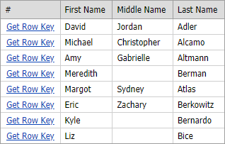

<!-- default badges list -->

[](https://supportcenter.devexpress.com/ticket/details/E4827)
[](https://docs.devexpress.com/GeneralInformation/403183)
[](#does-this-example-address-your-development-requirementsobjectives)
<!-- default badges end -->

# Grid View for ASP.NET MVC - How to call an Action method on a custom button click

This example demonstrates how to call an Action method when a custom button is clicked and obtain the clicked row's key value in the Action.



1.  Add a custom button to the [CustomButtons](https://docs.devexpress.com/AspNet/DevExpress.Web.GridViewCommandColumn.CustomButtons) collection.

    ```cs
    settings.CommandColumn.CustomButtons.Add(new GridViewCommandColumnCustomButton() { ID = "btnGetKey", Text = "Get Row Key" });
    ```

1. Use the [GridViewClientSideEvents.CustomButtonClick](https://docs.devexpress.com/AspNet/DevExpress.Web.GridViewClientSideEvents.CustomButtonClick) property to assign a JavaScript function to the [CustomButtonClick](https://docs.devexpress.com/AspNet/js-ASPxClientGridView.CustomButtonClick) event. 

    Call the [Url.Action](https://learn.microsoft.com/ru-ru/dotnet/api/system.web.mvc.urlhelper.action) method to generate a URL to an action method and send the resulting string to the `CustomButtonClick` function as a parameter.

    ```cs
    settings.ClientSideEvents.CustomButtonClick =
        string.Format("function(s, e) {{ CustomButtonClick(s, e, '{0}'); }}", Url.Action("About", "Home"));
    ```

1. Implement the `CustomButtonClick` JavaScript function.

    * Use the [GetRowKey](https://docs.devexpress.com/AspNet/js-ASPxClientGridView.GetRowKey(visibleIndex)) method to get the clicked row's key value. 
    * Add the key value parameter to the specified destination URL.
    * Specify the `window.location.href` property to navigate to the destination URL.

    ```js
        function CustomButtonClick(s, e, url) {
            var key = s.GetRowKey(e.visibleIndex);
            if (e.buttonID === "btnGetKey") {
                var destUrl = url + "/" + key;
                window.location.href = destUrl;
            }
        }
    ```

1. Use the Action's parameter to retrieve the passed key value.  

    ```cs
    public ActionResult About(int id) { 
        ViewData["Key"] = id; 
        return View(); 
    } 
    ```

## Files to Review

* [GridViewPartial.cshtml](./CS/Sample/Views/Home/GridViewPartial.cshtml) (VB: [GridViewPartial.vbhtml](./VB/Sample/Views/Home/GridViewPartial.vbhtml))
* [Index.cshtml](./CS/Sample/Views/Home/Index.cshtml) (VB: [Index.vbhtml](./VB/Sample/Views/Home/Index.vbhtml))
* [HomeController.cs](./CS/Sample/Controllers/HomeController.cs) (VB: [HomeController.vb](./VB/Sample/Controllers/HomeController.vb))
* [About.cshtml](./CS/Sample/Views/Home/About.cshtml) (VB: [About.vbhtml](./VB/Sample/Views/Home/About.vbhtml))


<!-- feedback -->
## Does this example address your development requirements/objectives?

[](https://www.devexpress.com/support/examples/survey.xml?utm_source=github&utm_campaign=asp-net-mvc-grid-call-action-on-custom-button-click&~~~was_helpful=yes) [](https://www.devexpress.com/support/examples/survey.xml?utm_source=github&utm_campaign=asp-net-mvc-grid-call-action-on-custom-button-click&~~~was_helpful=no)

(you will be redirected to DevExpress.com to submit your response)
<!-- feedback end -->
